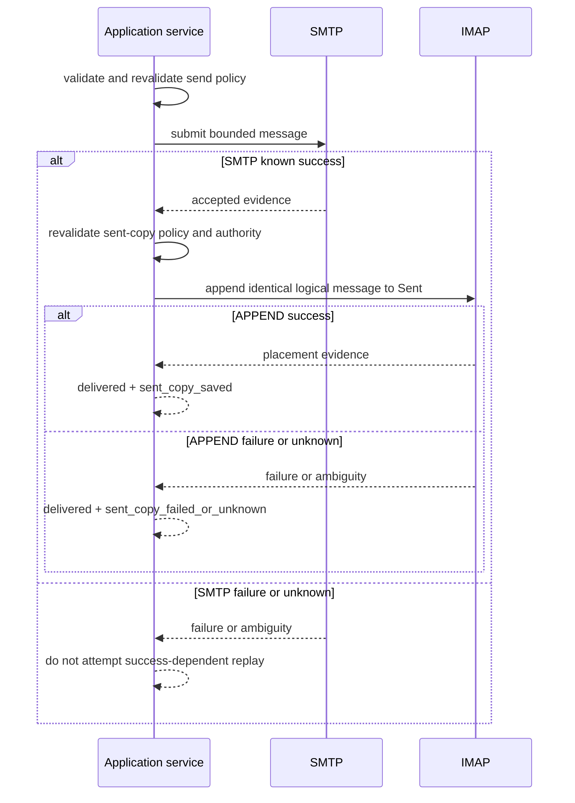

# 07. Mail Mutations and Provider Effects

## Effect Model

Mail mutations cross authority boundaries. SQLite cannot make an IMAP or SMTP
effect atomic with local persistence. Each workflow therefore identifies its
independent provider effects, revalidates authority before each, records the
available protocol evidence, and returns per-target success, failure, unknown,
or success-with-warning.

Mutation policy is deny-by-default for protected effect classes. The management
UI in this delivery exposes no mail mutation route.

## Common Mutation Pipeline

For each target, in caller order:

1. validate all request and aggregate limits;
2. read and validate the current account, mailbox, and effective policy;
3. qualify current provider state and required capability;
4. check cancellation before the effect begins;
5. resolve only the required selected-account secret and construct the provider;
6. execute one bounded provider effect;
7. classify protocol evidence without guessing;
8. update or invalidate the metadata projection in a separate local phase;
9. preserve provider success if projection work fails, adding a bounded warning.

Independent targets continue or stop according to the documented per-tool
policy, but already completed effects are never rolled back fictionally. Results
preserve input order.

## Public Numeric IDs

Existing public message IDs identify one canonical positive decimal ASCII mailbox
UID for compatibility. Zero, leading zero, non-ASCII digits, signs, UID ranges or
sets, control characters, and values above the IMAP UID limit are rejected before
provider access. The low-level provider entry repeats that validation before
opening IMAP as defense in depth. IDs do not carry the UIDVALIDITY observed during
a prior listing. Before a
mutation the service selects the current account/mailbox, obtains current
UIDVALIDITY where feasible, and avoids using stale projected placement as proof.
It does not claim to detect every listing-epoch race. An epoch-bound public
identifier requires a future versioned contract.

## Flags and Read State

`set_email_flags` changes one bounded list of UIDs with exactly one operation,
`add` or `remove`, and one non-empty unique flag list. The public mutable set is
limited to `\Seen`, `\Flagged`, `\Answered`, and `\Draft`. `\Recent` is
server-controlled, provider-specific keywords are outside the portable
contract, and `\Deleted` remains exclusively owned by the scoped
`delete_emails` workflow.

The provider issues one UID-scoped `+FLAGS.SILENT` or `-FLAGS.SILENT` command per
target, preserving caller order and per-UID evidence without claiming
multi-target atomicity. Mark-read remains a focused MCP workflow and delegates
to the same implementation as adding `\Seen`; removing `\Seen` provides the
explicit mark-unread operation. Body reads do not mutate flags unless their
separate `mark_as_read` option requests the focused workflow. Tagged protocol
completion produces individual success, failure, or unknown outcomes, and an
ambiguous effect is not retried automatically.

`set_email_tags` is the separate provider-keyword workflow. Inputs use
configured semantic names only; every requested tag must exist in the current
account configuration and have `writable=true`. Name matching is
ASCII-case-insensitive and non-writable is the safe per-tag default. The request
selects exactly one idempotent operation, `add` or `remove`, and a non-empty
unique semantic-tag list. The provider issues one UID-scoped `+FLAGS.SILENT` or
`-FLAGS.SILENT` command per target with only the resolved provider keywords.
Unknown provider keywords, read-only configured tags, and all standard system
flags are untouched. The workflow retains input-aligned per-UID outcomes,
sender-policy behavior, timeout/ambiguity evidence, current-authority checks,
and projection invalidation. It makes no mailbox-wide or multi-target atomicity
claim.

## Save or Append

Saving a message to a mailbox is an IMAP APPEND effect. The request bounds
headers, recipients, subject, body, encoded message bytes, attachments, and
destination. File attachments preserve their inferred MIME main type and subtype
rather than being coerced into `application/*`. APPEND flags accept system flags
and provider keywords only when each is one complete IMAP atom; legal keyword
forms such as `$Forwarded`, dotted names, and leading digits are not narrowed by
a local identifier grammar, while controls and protocol specials are rejected.
Every APPEND path serializes the complete MIME message with CRLF line endings and
does not emit bare LF or CR line breaks, including draft and sent-copy placement.
When composing `In-Reply-To` or `References`, a simple whitespace-separated list
of bare or bracketed Message-IDs is normalized to the bracketed RFC 5322 `msg-id`
form without double-wrapping. Non-simple historical syntax is preserved intact
rather than partially rewritten.

Message encoding and IMAP session mode are separate decisions. After
authentication and before selecting a mailbox, every APPEND workflow refreshes
capabilities. A message whose address-bearing or thread headers require RFC 6532
syntax requires an enabled UTF-8 session; a `UTF8=ONLY` server requires that
session even for an ASCII-header message. Negotiation requires `ENABLE` plus
`UTF8=ACCEPT` or `UTF8=ONLY` and is accepted only after positive `ENABLED
UTF8=ACCEPT` evidence.

Once enabled, LIST mailbox names are interpreted as their literal UTF-8 spelling
and SELECT/APPEND use escaped UTF-8 quoted syntax rather than Modified UTF-7. The
message itself uses RFC 6855 `UTF8 (~{N}` literal8 framing only when its headers
actually require RFC 6532; an ASCII-header message on `UTF8=ONLY` still uses the
base message literal. Missing or incomplete required capability evidence returns
the fixed `utf8-append-unsupported` failure before SELECT or APPEND. A
cancellation, timeout, or transport failure after the synchronizing APPEND starts
aborts the connection and is never replayed automatically.

Success requires positive APPEND evidence. If APPEND succeeds but UID mapping or
projection update is unavailable, the result remains success with an unknown
placement/projection warning rather than resubmitting.

## Move and Archive

A move uses native UID MOVE when the provider advertises and supports it. A
fallback may use UID COPY followed by a deletion/expunge sequence only when the
provider offers a scoped primitive that cannot expunge unrelated messages.

Archive resolves an explicit destination policy and then follows the same move
contract. Destination creation, if supported, is a separate effect with its own
policy and evidence; it is not silently attempted after an unsafe fallback.

## Spam and Ham Marking

Marking a message as spam or as ham is not a server-side classification
decision; the caller supplies the judgment and the server only relocates the
message. Marking as spam resolves the Junk mailbox as a destination policy
and follows the same move contract as Archive. Marking as ham follows the
identical contract in reverse: the Junk mailbox is resolved as the source
(auto-detected the same way, or supplied explicitly) and `INBOX` is the fixed
destination. Neither direction sets a new IMAP flag or keyword; the mutation
is move-only.

## Delete and Scoped Expunge

Delete marks only selected UIDs and removes only those targets with a scoped
provider primitive. Allowed strategies are:

- native UID MOVE to trash under explicit policy;
- UID STORE plus UID EXPUNGE when UIDPLUS/scoped expunge is available;
- another provider primitive proven to affect only requested targets.

Bare mailbox-wide `EXPUNGE` is forbidden. If a provider lacks a safe scoped
primitive, the operation rejects before marking any message deleted. It MUST NOT
attempt an unsafe best effort.

## SMTP Delivery and Sent Copy

The configured sender identity remains structured across protocol boundaries.
The account email address is the RFC 5321 reverse-path used by `MAIL FROM`; the
optional display name is formatted and quoted only in the RFC 5322 `From` header.
A provider adapter MUST NOT recover an envelope sender by parsing a formatted
header, and a parse failure MUST NOT fall back to sending that complete header as
the reverse-path. The same correctly formatted `From` header is used for SMTP
message data, drafts, and Sent copies.

SMTPUTF8 is required when any envelope sender or recipient addr-spec is
non-ASCII, or when any From, Sender, To, Cc, Bcc, Reply-To, Message-ID,
In-Reply-To, or References header requires RFC 6532 syntax. The complete message
is serialized under the matching policy and `SMTPUTF8` is requested on `MAIL`;
a provider without the extension returns the fixed `smtp-utf8-unsupported`
failure before `MAIL`, `RCPT`, or `DATA`. A non-ASCII display name paired with an
ASCII addr-spec remains an encoded RFC 5322 display name and does not alone
require SMTPUTF8. RFC 6531 additionally requires an SMTPUTF8-aware server to
advertise `8BITMIME` and an SMTPUTF8-aware client to request `BODY=8BITMIME`;
missing 8BITMIME therefore returns `smtp-8bitmime-required` before `MAIL` even
when the MIME body itself is otherwise 7-bit clean.

The final serialized SMTP message is classified before `MAIL` according to the
transport required by its body. Outside the RFC 6531 case above, a 7-bit-clean
body uses ordinary `DATA` without requesting `BODY=8BITMIME`. Raw high-bit body
octets require an advertised
`8BITMIME` capability and `BODY=8BITMIME`; otherwise every target returns the
fixed `smtp-8bitmime-required` failure before `MAIL`, `RCPT`, or `DATA`. A leaf
that emits raw high-bit payload bytes without declaring the `8bit` MIME transfer
encoding is malformed rather than eligible for capability-based transport; it
returns `smtp-mime-transport-invalid` at the same pre-effect boundary. Composite
`multipart` and `message` entities also reject transfer encodings other than
`7bit`, `8bit`, or `binary`, and a composite entity carrying actual 8-bit child
data must itself declare the `8bit` domain.

`8BITMIME` does not make arbitrary binary content safe for the line-oriented
`DATA` command. A MIME tree declaring `Content-Transfer-Encoding: binary`, or a
serialized message containing NUL, bare line endings, or a line longer than the
RFC 5321 limit, requires a binary submission path. This client does not implement
`BINARYMIME` with `CHUNKING`/`BDAT`, so it returns the fixed
`smtp-binarymime-unsupported` failure before `MAIL` even when the provider
advertises those capabilities. The preflight does not silently rewrite MIME
parts or attempt a recursive base64/quoted-printable downgrade.

SMTP delivery and IMAP sent-copy APPEND are independent effects:

A sent-copy failure MUST NOT trigger SMTP resubmission. The result separately
reports delivery and sent-copy outcomes. If SMTP is unknown, automated replay is
forbidden; operator reconciliation is required.

Message-ID or other local identifiers can aid reconciliation but do not create
exactly-once guarantees. The delivery result carries the composed `Message-ID`
only once the provider has accepted the message data; a rejected or ambiguous
submission MUST report no identifier. A caller keeping its own record of what was
sent can therefore cite an identifier exactly when the server can vouch for it,
rather than choosing between an empty record and an invented one. The sent-copy
APPEND reports its own identifier independently and never substitutes for
delivery evidence.

### Forward

Forwarding an existing message is a send workflow with one additional preceding
provider effect. It performs three independent effects, each preceded by a fresh
resolution of current account authority. Send capability and recipient policy
are revalidated before the source read and again before SMTP delivery; the
sent copy follows the pre-existing authority-change rules below, which skip it
on lifecycle loss while never erasing reported SMTP success:

1. a bounded IMAP read of the source message in the requested source mailbox;
2. SMTP delivery of the newly composed message;
3. the IMAP sent-copy APPEND described above.

A forward is a submission: the workflow MUST reject an account without send
capability before the source read performs any provider I/O. That precondition
uses non-secret authority evidence (outgoing endpoint presence) so the outgoing
secret is still resolved only by the SMTP delivery effect itself; opening the
outgoing provider remains the enforcing boundary.

The source read MUST complete successfully before an SMTP session is opened. A
failed, denied, cancelled, or ambiguous source read aborts the workflow with no
delivery attempt, because a forward delivered without the parts it was supposed
to carry is silent content loss rather than partial success. The service MUST
NOT substitute an empty or partial body for an unreadable source.

The composed subject derives from the source subject with one `Fwd:` prefix and
is not prefixed again when the source subject already carries that prefix in any
letter case. Forwarded content is re-composed as a bounded plain-text block
carrying the original's originator, recipient, date, and subject headers; it does
not reproduce the source's HTML rendering, and it is bounded by the same compose
body limits as other send input. The source body MUST be parsed with a window
wider than the compose byte limit so that display-oriented parser truncation can
never yield a sendable value: an over-limit source body is rejected by compose
validation, never silently shortened. Re-attached parts preserve their source
MIME main type, subtype, and parameters rather than being coerced into
`application/*`. Their per-part and aggregate size evidence MUST conservatively
cover serialization under both possible SMTP wire policies, including CRLF
expansion, because the final SMTP/SMTPUTF8 choice is not known until the full
message and envelope are composed. A re-attached part carrying correctly labeled
raw 8-bit content widens the composed container's declared transfer-encoding
domain to `8bit`, and transport acceptability is then decided by the shared SMTP
DATA transport classification owned by the send boundary above.

The source read is a mail read and is subject to the sender allowlist under the
same privacy rule as every other read path: a blocked source is not
distinguishable from a missing one. The source sender is retained as internal
policy evidence and MUST be checked against the freshly resolved sender policy
again before SMTP; a policy tightened after the read aborts delivery with the
same not-found-shaped denial. A source whose top-level entity is itself the
attachment is re-attached stripped to its MIME content headers, so the
source's envelope header block (Received chain, Message-ID, and any Bcc a Sent
copy carries) never rides into the outgoing message. The quoting block carries
only provenance the source itself asserts; an absent Date header is omitted,
never fabricated. The forward's own recipients are subject to
the recipient allowlist before any provider effect. Delivery and sent-copy
outcomes are represented independently under the rules above; an ambiguous SMTP
outcome is `unknown`, sets `reconciliation_needed`, and is never automatically
replayed.

## Authority Changes Between Effects

Before sent-copy, destination creation, or another independent effect, the
service re-reads current account lifecycle, endpoint/binding revision, and policy.
If authority was disabled or tightened after SMTP success, the secondary effect
is skipped with an explicit policy/authority outcome while SMTP success remains
reported.

## Timeouts, Cancellation, and Ambiguity

Deadlines bound connection and protocol commands where the provider adapter can
enforce them. Cancellation before an effect yields cancelled/no-effect. Once
bytes or a mutation command may have reached a provider, interrupted evidence is
classified unknown unless the protocol proves success or failure.

Retries are allowed only for operations proven idempotent under the same current
authority and request identity. Non-idempotent APPEND, SMTP delivery, move, or
delete is not automatically replayed after unknown. Every public aggregate that
contains an `unknown` target, APPEND, delivery, or sent-copy outcome sets
`reconciliation_needed=true` as a model invariant; successful projection
invalidation cannot clear provider ambiguity.

## Result Bounds and Error Safety

Mutation requests bound target count, address count/bytes, headers, body, total
encoded bytes, mailbox names, and batch size. Results bound per-target details,
warnings, provider-code normalization, and aggregate serialization. Public send
results may include only reviewed fixed delivery-detail tags such as
`smtp-mail-rejected`, `smtp-recipient-rejected`, `smtp-8bitmime-required`,
`smtp-binarymime-unsupported`, `smtp-mime-transport-invalid`, or
`provider-timeout` alongside the affected
target. Unrecognized detail is omitted. Raw provider responses,
message content, credentials, stack traces, and uncontrolled local paths do not
enter public errors.

## Acceptance Criteria

1. Every mutation revalidates current authority before each independent provider
   effect and resolves only the needed account/role secret.
2. Per-target results preserve caller order and distinguish success, failure,
   unknown, cancelled-before-effect, and local projection warning.
3. Body retrieval does not mark read by default; explicit mark-read and bounded
   approved flag additions/removals use one shared effect-aware implementation.
4. Move/archive/spam-ham-marking/delete use native or proven scoped primitives,
   and tests prove no code path issues bare `EXPUNGE` or marks deleted before
   rejecting unsafe capability.
5. Provider success remains success when projection persistence fails.
6. SMTP and sent-copy outcomes are independently represented, and sent-copy
   failure/unknown never causes SMTP replay. Tests prove display names are safely
   formatted while the SMTP reverse-path uses only the configured account
   address, including when the display name itself contains `@` and when the
   account address requires SMTPUTF8/RFC 6532 serialization. Submission results
   report the delivered `Message-ID` when, and only when, the provider accepted
   the message data. Tests prove a send and a forward name the identifier the
   recipient actually received, that it survives an independent sent-copy
   failure, and that a rejected, timed-out, or ambiguous delivery reports none.
7. Cancellation and timeout tests cover before-effect, known-after-effect, and
   ambiguous boundaries for IMAP and SMTP.
8. Public numeric IDs are documented and tested as current-mailbox compatibility
   IDs, not durable listing-epoch tokens.
9. No management UI route can invoke mail mutations in this delivery.
10. Byte-level tests prove every IMAP APPEND path serializes MIME messages with
    CRLF line endings and emits no bare LF or CR line breaks. Composition tests
    also prove that bare simple Message-IDs gain RFC angle brackets, already
    bracketed IDs are not double-wrapped, mixed `References` lists normalize as
    one chain, and non-simple historical syntax remains intact.
11. Interoperability tests prove complete IMAP atom validation, full-message
    SMTPUTF8 detection and pre-effect rejection, display-name downgrade without
    a false SMTPUTF8 requirement, pre-SELECT RFC 6855 negotiation, exact literal8
    APPEND framing, and abort/no-replay behavior at ambiguous framing boundaries.
12. Byte-level SMTP tests prove that ordinary 7-bit-clean messages do not
    request `BODY=8BITMIME`, SMTPUTF8 messages require both advertised SMTPUTF8
    and 8BITMIME plus both `MAIL` parameters, correctly labeled raw high-bit body
    octets require an advertised `8BITMIME` capability, and mislabeled high-bit payloads, binary
    transfer encoding, NUL, bare line endings, and overlong DATA lines fail
    before `MAIL`, `RCPT`, or `DATA` without MIME
    rewriting or automatic replay.
13. Forward executes source read, SMTP delivery, and sent copy as three
    independent effects with authority revalidated before each. Tests prove that a
    send-incapable account performs no provider I/O, that a failed, denied, or
    allowlist-blocked source read aborts before any SMTP session opens, that a
    sender policy tightened after the read still aborts before SMTP, that a
    source body beyond the display parse window is forwarded in full or rejected
    as over-limit rather than silently truncated, that a root-as-attachment
    source is re-attached without its envelope headers, that re-attached parts
    preserve source MIME type and parameters, that forwarded-part size evidence
    includes SMTP CRLF expansion, and that an existing `Fwd:` subject prefix is
    not duplicated.
14. Tag mutation tests prove add, per-message replacement, empty replacement,
    multiple UIDs, non-writable rejection, and preservation of system,
    read-only, and unknown keywords with the same effect evidence and metadata
    invalidation rules as other mailbox mutations.
15. Spam/ham marking tests prove Junk-folder auto-detection via the RFC 6154
    `\Junk` flag and name fallback, that marking ham without an explicit
    mailbox auto-detects the same Junk folder as the move source, that an
    explicit mailbox skips discovery, and that a missing distinct Junk folder
    fails before any move effect with the RFC 6154 `\Junk` flag and common
    names named in the error.
